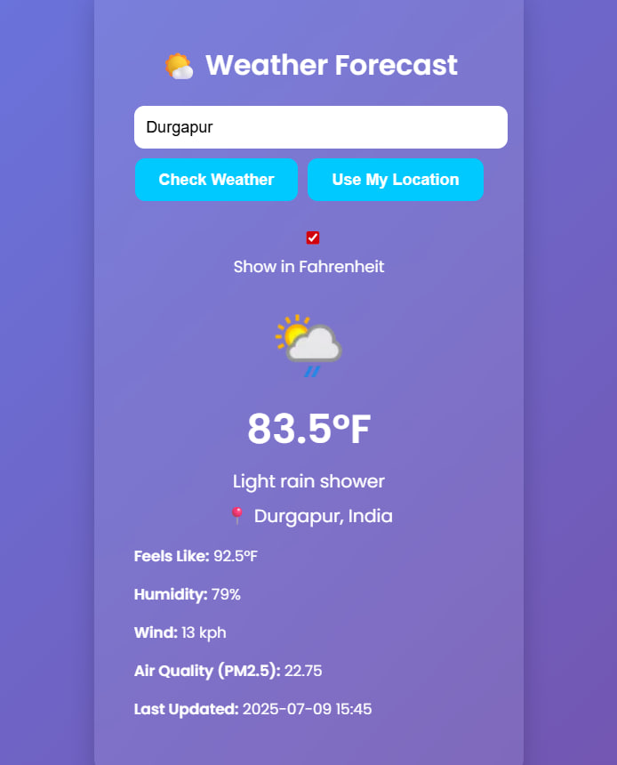

# 🌦️ Weather Forecast App

A sleek, fully functional weather app using **WeatherAPI**, built with **HTML, CSS, and JavaScript**. Includes geolocation support, unit toggling, and beautiful glassmorphism UI design.

---

## 🚀 Live Demo
 
📹 [Watch Full App Demo](./assets/demo-video.mp4)

---

## 📸 Screenshots

### 🟦 Before Search

### 🟩 After Fetching Weather

---

## 🔥 Features

- 📍 Get weather using **geolocation** (\"Use My Location\")
- 🔍 Search weather by any **city name**
- 🌡️ Switch between **Celsius and Fahrenheit**
- 💨 Shows **humidity**, **wind speed**, and **air quality (PM2.5)**
- 🎨 **Glassmorphism UI** with modern look
- ✅ **Fully responsive** on desktop and mobile

---

## 🛠️ Run Locally

''' bash
git clone https://github.com/Shreya-Trivedy/weather-app.git
cd weather-app
open index.html  # or just double-click index.html

## 📁 Folder Structure

weather-app/
├── index.html
├── style.css
├── script.js
├── assets/
│   ├── screenshot-before.png
│   ├── screenshot-after.png
│   └── demo-video.mp4
└── README.md

## 🔮 Future Improvements :-

📲 Convert to a Progressive Web App (PWA)
🗺️ Add map preview of location
📅 Add 3-day or 7-day weather forecast
🌍 Multi-language support

## 📃 License
MIT © Shreya Trivedy
